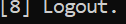

# Project 3 - Bank System Management (Full Version)

A complete C++ Bank Management System built with **Procedural Programming**, featuring:
- **Login System** with Username & Password
- **User Permissions** (Full Access or Custom Permissions)
- **Clients Management** (List, Add, Delete, Update, Find)
- **Transactions** (Deposit, Withdraw, Total Balances)
- **Manage Users** (List, Add, Delete, Update, Find)

📄 **Source Code**: [Project-3-Bank-System-Management/Project-3-Bank-System-Management.cpp](Project-3-Bank-System-Management/Project-3-Bank-System-Management.cpp)

---

## Related Projects

This project is part of a series:
- [Project 1 - Bank System Management](https://github.com/abdulrahamanharitani-ai/Project-1-Bank-System-Management) — Clients List only
- [Project 2 - Bank System Management](https://github.com/abdulrahamanharitani-ai/Project-2-Bank-System-Management) — Clients + Transactions (Deposit, Withdraw, Total Balances)
- **Project 3 - Bank System Management** — Full System with Login & Permissions ← *You are here*

---

## Features

### 1. Login System
- Secure login with Username and Password.
- Invalid login handling with retry.

### 2. Permissions System
- Full Access (Admin).
- Custom permissions for each user:
  - List Clients
  - Add New Client
  - Delete Client
  - Update Client
  - Find Client
  - Transactions
  - Manage Users

### 3. Clients Management
- Show all clients.
- Add new clients.
- Delete clients.
- Update client info.
- Find client by account number.

### 4. Transactions
- Deposit money.
- Withdraw money (with balance validation).
- Show total balances.

### 5. Manage Users
- List all users.
- Add new users.
- Delete users (except Admin).
- Update user info.
- Find user by username.

---

## Data Structures

### sClient
| Field           | Type     |
|-----------------|----------|
| AccountNumber   | string   |
| PinCode         | string   |
| Name            | string   |
| Phone           | string   |
| AccountBalance  | double   |
| MarkForDelete   | bool     |

### stUser
| Field         | Type     |
|---------------|----------|
| Username      | string   |
| Password      | string   |
| Permissions   | int      |
| MarkForDelete | bool     |

---

## Data Files

The system uses two text files to store data:
- `Clients.txt` — Stores client records.
- `Users.txt` — Stores user records (must include an Admin user).

**Default Admin Credentials:**
- **Username**: `Admin`
- **Password**: `1234`

---

## Example Usage

```cpp
int main()
{
    Login();
    system("pause>0");
    return 0;
}
```

## Screenshots

### 🔐 Login System

| Login Screen | Login with User1 |
|:---:|:---:|
|  |  |

| Invalid Login | Logout |
|:---:|:---:|
|  |  |

### 📋 Main Menu

| Main Menu Screen | Return to Main Menu |
|:---:|:---:|
|  |  |

### 👥 Clients Management

| Client List | Add New Client |
|:---:|:---:|
|  |  |

| Delete Client | Update Client |
|:---:|:---:|
|  |  |

| Find Client |
|:---:|
|  |

### 💰 Transactions

| Transactions Menu | Deposit |
|:---:|:---:|
|  |  |

| Withdraw | Total Balances |
|:---:|:---:|
|  |  |

### 👤 Manage Users

| Manage Users Menu | User List |
|:---:|:---:|
|  |  |

| Add New User | Delete User |
|:---:|:---:|
|  |  |

| Cannot Delete Admin | Update User (1) |
|:---:|:---:|
|  |  |

| Update User (2) | Find User |
|:---:|:---:|
|  |  |

| Return to Main Menu (from Manage Users) |
|:---:|
|  |

### 🚫 Access Denied

| User1 Trying to Access Manage Users Without Permission |
|:---:|
|  |

## Requirements
Visual Studio 2022 or any C++ compiler supporting C++11 or later.

## Author
Abdulrahman Al-Haritani
